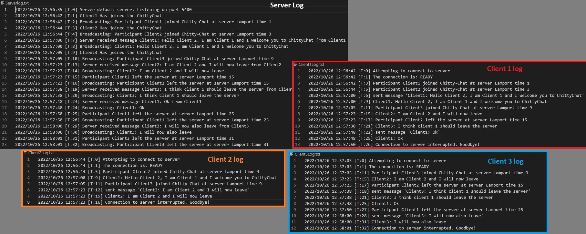

# System requirements

## R1: Chitty-Chat is a distributed service, that enables its clients to chat. The service is using gRPC for communication. You have to design the API, including gRPC methods and data types.  Discuss, whether you are going to use server-side streaming, client-side streaming, or bidirectional streaming?

We use bidirectional streaming. The stream opens when the client connects to the server, and stays open for the duration of the chat,so that we know a client has disconnected from the server when the stream closes

## R2: Clients in Chitty-Chat can Publish a valid chat message at any time they wish.  A valid message is a string of UTF-8 encoded text with a maximum length of 128 characters. A client publishes a message by making a gRPC call to Chitty-Chat

The program can handle sending messages of any size (that we tested), at any time through gRPC calls.

## R3: The Chitty-Chat service has to broadcast every published message, together with the current Lamport timestamp, to all participants in the system, by using gRPC. It is an implementation decision left to the students, whether a Vector Clock or a Lamport timestamp is sent

The server broadcasts any message received to all connected clients, along with a synchronized lamport timestamp. 

## R4: When a client receives a broadcasted message, it has to write the message and the current Lamport timestamp to the log

The client prints the received message along with the synchronized lamport time. (If a server sends a message at lamport time X, the client will print at X+1 because we see the receive action as a separate event in terms of lamport time)

## R5: Chat clients can join at any time

Chat clients can join the server at any time.

## R6: A "Participant X  joined Chitty-Chat at Lamport time L" message is broadcast to all Participants when client X joins, including the new Participant

The server will announce and broadcast when a user has joined.

## R7: Chat clients can drop out at any time

Chat clients can drop out from the chat, by simply closing the cmd-client. 

The client leaving will also receie a good-bye message in the log to confirm they have disconnected (if closed with control+C).

## R8: A "Participant X left Chitty-Chat at Lamport time L" message is broadcast to all remaining Participants when Participant X leaves

The server will broadcast when a client has left the server. 

# Technical Requirements

## Use gRPC for all messages passing between nodes

The server uses gRPC for all message passing.

## Use Golang to implement the service and clients

All code is written in golang.

## Every client has to be deployed as a separate process

Each client joins as a separate process via a new command prompt.

## Log all service calls (Publish, Broadcast, ...) using the log package

Both client and Server makes a log with a helpermethod SetLog()

.JPG)
Details.JPG)

## Demonstrate that the system can be started with at least 3 client nodes

See Chatlog example

## Demonstrate that a client node can join the system

See Chatlog example

## Demonstrate that a client node can leave the system

See Chatlog example
