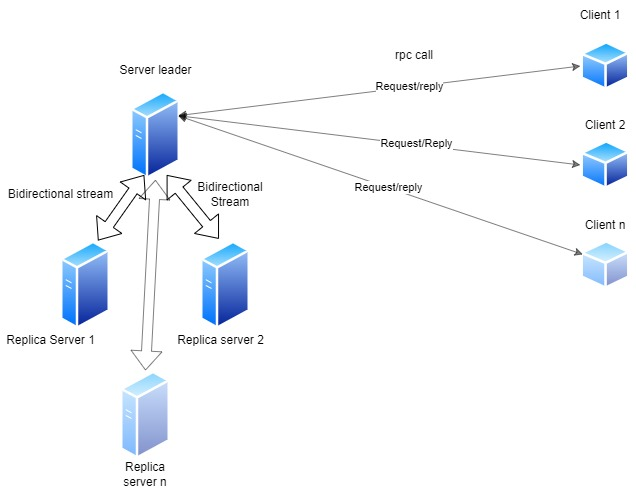
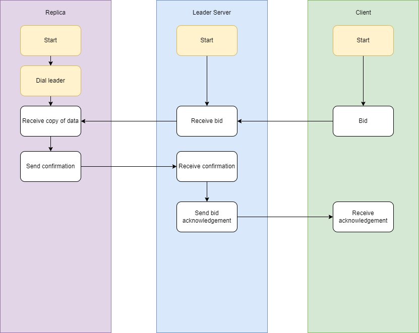

# Introduction

The goal of this hand-in is to implement, using Go, a simple auction system that is resilient to at most one node failure. 

# Architecture

The system uses passive replication, such that all requests are handled by the leader (primary replica), and an arbitrary number of backup replicas exist to have a copy of the state of the leader, ready to take over in the event of the leader crashing.  

The architecture is set up in such a way that the client need not know anything about the state of the system of servers. It is the responsibility of the servers to always provide the service at a particular port. If a leader dies, another replica should take over and start listening on the same port as the previous leader - and have a state consistent with the previous leader. This means that the distributed nature of the system is transparent to clients.

Our system thus consists of 1 leader server, and multiple (from 1 to n) server replicas that are connceted via bidirectional streams. On the client side at least 1 (and possibly many) client communicates with the leader server via rpc calls.

## Diagram

## Client

For this reason the code for the client (`Client.go`) is quite straightforward. It dials the service at port 5000 and then allows input of bids using stdin, which are subsequently sent to the server running on that particular port. Again, the client does not know nor care about replicas or which exact server instance is handling individual request.

## Server

The server (`Server.go`) has all logic for handling incoming bids from clients, keeping states in sync across replicas and handling failure of replicas though election of a new leader. A server acting as leader is to always a have a client-facing service running on port 5000 and a server-facing service on port 5400, that other replicas will dial.

The leader maintains 

* a map `nodes` of all the replicas that are connected to it
* highest bid amount `highBid` and the identifier of the highest bidder `highBidder`
* a bool `auctionLive` indicating whether an auction is ongoing
* a list `leaderQueue` of identifiers of potential leaders, for use in case of a node failure

Whenever there is a change to the state of the server, it will broadcast its updated state to all other replicas (for instance in the event of a new and higher bid, or in the event of a new replica joining the system). Each replica subsequently updates its own state to match that of the one broadcasted by the leader.

### Node failures

#### Leader failure

The stream between the leader and its replicas will fail if the leader crashes or shuts down. Upon this, all replicas will consult the first (that is, zeroth index) element of `leaderQueue` to determine who is to become the new leader. The replica whose own ID is equal to `leaderQueue[0]` will then consider itself the new leader, and start serving both clients and the remaining replicas. The first element of `leaderQueue` is also removed, as this node should no longer be a candidate for subsequent elections. 

#### Replica failure

The leader - who is still operating in this case - removes the dead replica from `nodes` and `leaderQueue`. The list of potential candidates for future elections `leaderQueue` is subsequently updated for the remaining replicas. The system continues normal operation. 

# Running the system

 Start servers by running

​	`go run server/server.go -port 5400` (initially acting as leader)

​	`go run server/server.go -port 5401` (acting as replica)

​	and so on, in order of sequentially increasing port numbers...

Start any number of clients using 

​	`go run client/client.go -id 1`

​	`go run client/client.go -id 2`

​	and so on...

In the client terminal, you can make a bet by typing a number. Inputting any non-integer value will send a result request to the server.

# Correctness

## 1: Consistency

The system satisfies linearizability.

We define an event as an action that fully completes, for example a client calling bid and getting a response back (either success, fail or exception). With this definition of an event, we can determine that a client will always be given a correct answer to their request, because every server should have the same view regardless of any client updates to the data stored in the system.

Example: A client sends a bid to a server. The server receives the bid request, but before the server sends acknowledgement for a bid back to a client, it requires the bid to be reflected in the state of all other replicas. Once the server has received acknowledgement from all replicas, it can then send the final response to the client. This way, we always provide the correct shared value for subsequent reads.

Example picture of bid request/response.

In case of multiple clients sending a bid request, we make use of a lock on highestBid and highestBidder, so that they will be solved sequentially and avoid race conditions. (i.e. if two clients bid the same amount at the same time, only 1 will have the bid accepted, and the other will get a fail). 

## 2: Protocol correctness

The system correctly handles crashes of any client or server. 

Take the example of the leader failing. Backup replicas will know this by the closure of the stream between the leader and each of the backup replicas. The state (including the list of replicas) of the server is kept in sync across replicas during the lifespan of the leader. Thanks to this, we have consistent list of IDs of the potential new leaders amongst the remaining replicas. From this list, the nodes agree that the server with the lowest ID becomes the new leader. This replica thus becomes a leader, starts serving clients on port 5000 and the remaining replicas on 5400, and normal operation of the system is resumed.

In `log.txt`, we demonstrate the an instance of the system running.

Scenario:
1. We start a server 1 (port 5400, Server/Leader) and server 2 (port 5401, replica) and 1 client. 
2. Server1 starts an auction. 
3. Client sends a bid request to the auction. 
4. Server handles bid, sends copy of data to replica, then responds to client request. 
5. Client sends result request. 
6. Server replies with result of current highest bidder. 

7. **Server crashes**. Replica detects connection is dead, and makes itself the new leader. 

8. Client sends a bid for a lesser amount.
9. New leader handles bid, sends back failure response since amount is lower than the highest bid. 
10. New leader closes auction.
11. Client sends result request.
12. New Leader replies with result of winner bid.
